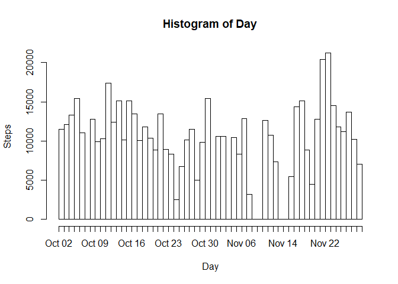
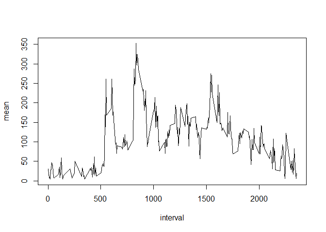
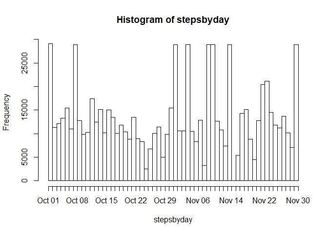
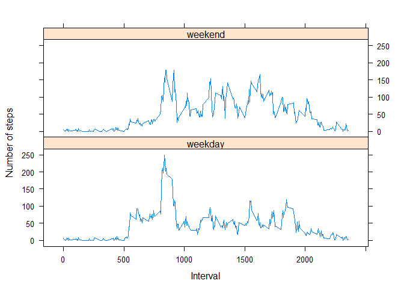

In order to reproduce these results, you need these libraries:


```r
library(dplyr)
library(lattice)
```

## Loading and preprocessing the data

Unzip and load the file to our variable(1):

```r
data <- read.csv(unz("activity.zip", "activity.csv"))
```

And change the variable date's type to Date type(2):

```r
data$date<-as.Date(data$date)
```

## What is mean total number of steps taken per day?

First, we shape the data in order to get the histogram:

```r
# Removing all the NA
df <- data[which(data$steps>0),]
# Dataset for the histogram
stepsbyday=rep(x = df$date, times = df$steps)
```
Then, we plot the histogram of the total number of steps taken each day(1):

```r
with(df, hist(stepsbyday,"days",freq = TRUE,ylab= "Steps", xlab = "Day"))
```

<!-- -->

Later, we calculate the sum of steps by day in order to get the mean and median(2):

```r
# Grouping
sum_stepsbyday<-df %>% group_by(date) %>% summarise(sum=sum(steps), .groups = 'drop')
# Getting mean and median
meanstep<-mean(sum_stepsbyday$sum)
medianstep<-median(sum_stepsbyday$sum)
cat("The mean of steps per day is",meanstep)
```

```
## The mean of steps per day is 10766.19
```

```r
cat("The median of steps per day is",medianstep)
```

```
## The median of steps per day is 10765
```

## What is the average daily activity pattern?

First, we group by interval in order to get the mean and plot it(1):

```r
# Getting means
mean_intervals<-df %>% group_by(interval) %>% summarise(mean=mean(steps), .groups = 'drop')
# Plotting it
plot(mean_intervals,type="l")
```

<!-- -->

Then, we get the maximum number of steps in the intervals(2):


```r
inter_w_maxavg<-mean_intervals[which.max(mean_intervals$mean),]
cat("The interval with the maximum number de steps is",inter_w_maxavg$interval)
```

```
## The interval with the maximum number de steps is 835
```

## Imputing missing values

We have this amount of missing values(1):

```r
tot_nas <- sum(is.na(data))
cat("The total of missing values is",tot_nas)
```

```
## The total of missing values is 2304
```

We decide to use the mean of steps by interval to fill the missing values(2):

```r
newdata<-left_join(data,mean_intervals,by="interval")
newdata$mean=floor(newdata$mean)
newdata[is.na(newdata$steps),]$steps=newdata[is.na(newdata$steps),]$mean
newdata[is.na(newdata$steps),]$steps=0
```

Then, we create a new dataset (3):

```r
newdata<- subset(newdata, select = - c(mean))
```

We use the same process as before in order to get the histogram(4):

```r
df <- newdata[which(newdata$steps>0),]
stepsbyday=rep(x = df$date, times = df$steps)

with(df, hist(stepsbyday,"days",freq = TRUE))
```

<!-- -->

```r
sum_stepsbyday<-df %>% group_by(date) %>% summarise(sum=sum(steps), .groups = 'drop')
meanstep<-mean(sum_stepsbyday$sum)
medianstep<-median(sum_stepsbyday$sum)
cat("The mean of steps per day is",meanstep)
```

```
## The mean of steps per day is 13149.11
```

```r
cat("The median of steps per day is",medianstep)
```

```
## The median of steps per day is 11458
```

## Are there differences in activity patterns between weekdays and weekends?

We create the new factor variable *daytype*, using weekdays as suggested(1):

```r
newdata <- newdata %>% mutate( daytype=ifelse(grepl("S(at|un)", weekdays(date)),"weekend","weekday")) 
newdata$daytype <- as.factor(newdata$daytype)
```

Then, we plot the panels with weekdays and weekends: 

```r
mean_weekdays<-newdata %>% group_by(interval,daytype) %>% 
summarise(mean=mean(steps), .groups = 'drop')
xyplot(mean_weekdays$mean~mean_weekdays$interval | mean_weekdays$daytype,
       type="l",layout = c(1,2), xlab = "Interval", ylab="Number of steps")
```

<!-- -->
